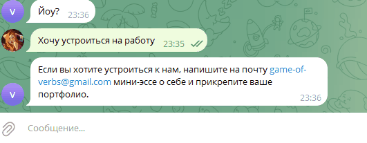

# Боты распознающие речь!
Проект сделан для: «Игра глаголов» – крупное онлайн-издательство, помогающее продвигать авторские блоги и публиковать книги.
 
## Чем же так хороши боты
 - Интеграция с Dialogflow - использует AI для понимания естественного языка
 - Умные ответы - определяет интент запроса и предоставляет релевантную информацию
 - Автоматическое логирование - отслеживание работы бота через Telegram-уведомления
 - Адаптивность, ботов можно обучить отвечать на любые запросы под разные задачи
   
Пример использования:



Попробовать ботов можно здесь:
- vk - [Напишите сообществу в сообщения](https://vk.com/club233826057)
- tg - [Нажмите /start](https://t.me/verb_game_helper_bot)


## Запуск

Для запуска сайта вам понадобится Python третьей версии.

Скачайте код с GitHub. Установите зависимости:
```
pip install -r requirements.txt
```

Интегрируйте google cloud с dialogflow - большой гайд об это [здесь](https://help.mypurecloud.com/articles/google-cloud-dialogflow-cx-quick-start-guide/)

Задайте переменные окружения:

`TELEGRAM_BOT_TOKEN` - Для начала создайте бота в [телеграме](https://telegram.me/BotFather), после вам выдадут токен.

`TELEGRAM_CHAT_ID` - Укажите ваш чат айди, узнать его можно написав боту [@userinfobot](https://telegram.me/userinfobot).

`GOOGLE_APPLICATION_CREDENTIALS` - Гайд как получить находится [здесь](https://github.com/googleapis/google-api-php-client/blob/main/docs/oauth-web.md#create-authorization-credentials)

`VK_TOKEN` - Для начала создайте групуу, а потом уже в настройках ищите "Работа с API"

`INTENTS_URL` - Укажите путь до файла с обучающими фразами, если захотите добавить новые

Запустите ботов:

VK:
```
python vk_helper_bot.py
```
TELEGRAM:
```
python telegram_helper_bot.py
```

## Цели проекта
Код написан в учебных целях — это урок в курсе по Python и веб-разработке на сайте [Devman](https://dvmn.org).
